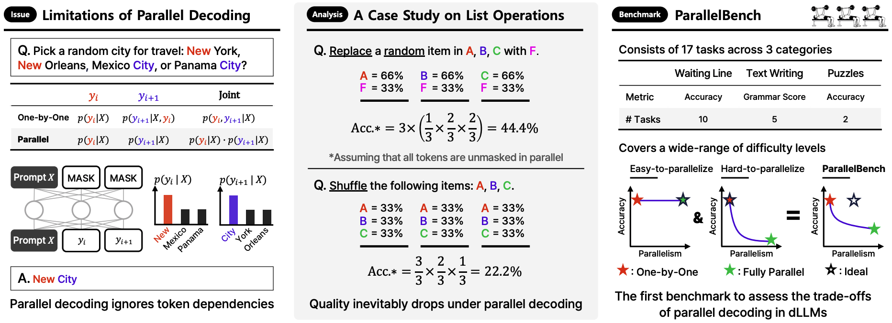

# ParallelBench: Understanding the Tradeoffs of Parallel Decoding in Diffusion LLMs

<p align="center">

</p>

<p align="center">
      <a href="https://scholar.google.com/citations?user=Q-ARWkwAAAAJ&hl=eh" target="_blank">Wonjun Kang</a><sup>*1,5</sup>,
      <a href="https://scholar.google.com/citations?user=G1EpeWYAAAAJ&hl=en" target="_blank">Kevin Galim</a><sup>*1</sup>,
      <a href="https://scholar.google.com/citations?user=IXJcR1gAAAAJ&hl=en" target="_blank">Seunghyuk Oh</a><sup>*1</sup>,
      <a href="https://scholar.google.com/citations?user=XJXKp60AAAAJ&hl=en" target="_blank">Minjae Lee</a><sup>1</sup>,
      <a href="https://yzeng58.github.io/zyc_cv/" target="_blank">Yuchen Zeng</a><sup>2,3</sup>,
      <a href="https://scholar.google.com/citations?user=jkXzD7YAAAAJ&hl=en" target="_blank">Shuibai Zhang</a><sup>2</sup>,<br>
      <a href="https://scholar.google.com/citations?user=si-368wAAAAJ&hl=en" target="_blank">Coleman Hooper</a><sup>4</sup>,
      <a href="https://yuezhouhu.github.io/" target="_blank">Yuezhou Hu</a><sup>4</sup>,
      <a href="https://scholar.google.com/citations?user=Oyy8aDMAAAAJ&hl=en" target="_blank">Hyung Il Koo</a><sup>1</sup>,
      <a href="https://ece.snu.ac.kr/en/research-faculty/faculty/fulltime?md=view&profid=p041" target="_blank">Nam Ik Cho</a><sup>5</sup>,
      <a href="https://kangwooklee.com/aboutme/" target="_blank">Kangwook Lee</a><sup>2,6,7</sup>
  </p>
  <p  align="center">
    <sup>1</sup>FuriosaAI, <sup>2</sup>UW-Madison, <sup>3</sup>Microsoft Research, <sup>4</sup>UC Berkeley,<br>
    <sup>5</sup>Seoul National University, <sup>6</sup>KRAFTON, <sup>7</sup>Ludo Robotics
   </p>
<p align="center">
    <a href="https://parallelbench.github.io/"></a>
    <a href="https://arxiv.org/abs/2510.04767"></a>
</p>


## 🔔 Updates

- **Jan 25, 2026** Paper accepted at ICLR 2026! 🎉
- **Oct 6, 2025** ParallelBench release!

## 🌍 Papers Using ParallelBench
The following works have evaluated their methods using ParallelBench. Check out how they tackle the speed-quality trade-off of parallel decoding!
- [Enabling Approximate Joint Sampling in Diffusion LMs](https://arxiv.org/abs/2509.22738)
- [Corrective Diffusion Language Models](https://arxiv.org/abs/2512.15596)

## 🗺️ Roadmap
We are currently working to support **new models** and implement **advanced unmasking methods**. If you are conducting dLLM research and would like to **contribute new models or methods**, please open an issue.

**New Models**
- [Fast-dLLM v2](https://github.com/NVlabs/Fast-dLLM)
- [LLaDA-MoE](https://github.com/ML-GSAI/LLaDA), [LLaDA2.x](https://github.com/inclusionAI/LLaDA2.X)

**Advanced Unmasking Strategies**

- [WINO](https://github.com/Feng-Hong/WINO-DLLM?tab=readme-ov-file)
- [DUS](https://github.com/omerlux/DUS)
- [APD](https://github.com/danielmisrael/apd)
- [SlowFast Sampling](https://github.com/LiangrunFlora/Slow-Fast-Sampling)
- [EB-Sampler](https://arxiv.org/abs/2505.24857v1)
- [KLASS](https://github.com/shkim0116/KLASS)
- [Uncode](https://github.com/NEUIR/Uncode?tab=readme-ov-file) (formerly, PC-Sampler)

## 🔎 Overview
<p align="center">

</p>

Diffusion LLMs (dLLMs) promise faster generation via parallel decoding. However, this speed often comes at the cost of quality, as they ignore token dependencies, an issue that existing benchmarks do not sufficiently capture. To address this issue, we introduce **ParallelBench**, the first benchmark designed to rigorously test this trade-off through realistic tasks that humans and autoregressive (AR) LLMs can easily solve, but which cause dLLMs to collapse as parallelism grows. We release **ParallelBench** to drive research towards truly efficient dLLMs that can overcome this challenge.

### Features

- **Information-Theoretic Analysis:**
We derive error bounds on parallel decoding for tasks with inter-token dependencies. Even an optimal model sees accuracy degrade as parallelism grows.

- **Quantitative Case Studies:**
Synthetic list operations (Copy, Replace, Shuffle) with closed-form accuracy formulas pin down exactly where and how parallel decoding breaks.

- **Realistic Benchmark Tasks:**
17 tasks across three categories (Waiting Line, Text Writing, Puzzles) that humans and AR LLMs solve easily, but expose clear quality drops in dLLMs under parallel decoding.


## 📐 Key Concepts

ParallelBench measures how **quality degrades as parallelism increases** in dLLMs. The key variable is **tokens per step (TPS)** — the number of tokens generated in parallel at each denoising step.

| Tokens per step | Meaning |
| :-: | --- |
| **1** | One-by-one decoding (equivalent to AR) |
| **k** | k tokens decoded in parallel per step |
| **max_tokens** | Fully parallel (one-step generation) |

ParallelBench evaluates **model + unmasking method** combinations. The same model can yield very different quality-speed trade-offs depending on which unmasking strategy is used.

The benchmark score is **PBx** — the maximum TPS at which a given combination still achieves at least **x%** average accuracy across all tasks. For example, PB80 = 8 means the combination can decode up to 8 tokens in parallel while maintaining ≥ 80% accuracy. Higher PBx values indicate better quality preservation under parallel decoding.

## ⚙️ Setup

These steps will guide you through setting up the necessary environment and dependencies.

### 1. Prerequisites
- **Conda**: For managing the environment.
- **NVIDIA GPU**: CUDA >= 11.8.
- **Java Development Kit (JDK)**: Required only for grammar-based evaluation metrics.

### 2. Set Python Environment

We use `uv` for faster package installation. The following commands will install PyTorch, `vLLM` for the LLM baselines, and all other required packages from `requirements.txt`.

```bash
# Use curl to download the script and execute it with sh:
curl -LsSf https://astral.sh/uv/install.sh | sh
# Install core dependencies
uv sync
```

### 3. Install Java (Optional)

If you need to run the **grammar-based** evaluations, install the JDK:

```bash
apt-get install openjdk-17-jdk -y
```

## ⚡ Quickstart

```bash
# Browse tasks (no GPU required)
pb browse                              # List all available tasks
pb browse waiting_line/copy            # View samples from a specific task
pb browse waiting_line/copy --index 3  # View a specific sample by index

# Run evaluation on a single task
pb eval --model parallelbench_llada \
  --model_args model_path=GSAI-ML/LLaDA-1.5 \
  --gen_kwargs k=32,unmasking=random \
  --tasks parallelbench_waiting_line_copy \
  --include_path parallelbench/tasks \
  --batch_size 1
```

## 🎯 Evaluation Coverage

### Tasks

| Category | Task | CLI task name |
| --- | --- | --- |
| Waiting Line (10) | Copy | `parallelbench_waiting_line_copy` |
| | Insert (index) | `parallelbench_waiting_line_insert_index` |
| | Insert (random) | `parallelbench_waiting_line_insert_random` |
| | Remove (index) | `parallelbench_waiting_line_remove_index` |
| | Remove (random) | `parallelbench_waiting_line_remove_random` |
| | Replace (index) | `parallelbench_waiting_line_replace_index` |
| | Replace (random) | `parallelbench_waiting_line_replace_random` |
| | Reverse | `parallelbench_waiting_line_reverse` |
| | Shuffle | `parallelbench_waiting_line_shuffle` |
| | Sort | `parallelbench_waiting_line_sort` |
| Text Writing (5) | Paraphrasing | `parallelbench_text_writing_paraphrasing` |
| | Summarization | `parallelbench_text_writing_summarization` |
| | Words to Sentence (easy) | `parallelbench_text_writing_words_to_sentence_easy` |
| | Words to Sentence (medium) | `parallelbench_text_writing_words_to_sentence_medium` |
| | Words to Sentence (hard) | `parallelbench_text_writing_words_to_sentence_hard` |
| Puzzles (2) | Latin Square (4x4) | `parallelbench_puzzles_latin_square_n4` |
| | Sudoku (4x4) | `parallelbench_puzzles_sudoku_n4` |

### Models

For additional models and unmasking methods, please refer to the [Roadmap](https://github.com/furiosa-ai/ParallelBench/#%EF%B8%8F-roadmap) section.

| CLI wrapper (`--model`) | Model family | Example `model_path` |
| --- | --- | --- |
| `parallelbench_llada` | LLaDA | `GSAI-ML/LLaDA-1.5` |
| `parallelbench_dream` | Dream, DiffuCoder | `Dream-org/Dream-v0-Instruct-7B` |
| `parallelbench_trado` | SDAR, TraDo | `JetAstra/SDAR-1.5-8B` |
| `parallelbench_sedd` | SEDD | `louaaron/sedd-medium` |
| `parallelbench_ar` | AR baselines (vLLM) | `meta-llama/Llama-3.1-8B-Instruct` |
| `parallelbench_api` | API models | Haiku, Mercury (requires `.env` keys) |

### Unmasking Methods

See the [Unmasking Strategies](#unmasking-strategies) table in Running Evaluations for the full list of CLI values and descriptions.


## 🛠️ Create Your Own Tasks

You can easily generate custom tasks from YAML configuration files. For example, to generate the test split and save locally:

```bash
pb data --split test --output_dir ./output
```

To generate and push directly to HuggingFace Hub:

```bash
pb data --split test --push --repo_id org/parallelbench
```

This command uses the configurations specified in `parallelbench/datasets/data/task_configs/`.

***

## 🧩 Adding Custom Models

You can integrate your own diffusion LLM by following the example in `parallelbench/models/local/example/`. For a detailed step-by-step guide (useful for AI agents), see [`docs_for_agents/adding_custom_models.md`](docs_for_agents/adding_custom_models.md). This directory contains:

- **`example_model.py`**: Template for implementing a custom model class that inherits from `LocalModel`
- **`constants.py`**: Example constants such as mask token IDs and valid unmasking strategies

### Implementation Steps

1. **Define Generation Config**: Extend `DllmGenerationConfig` to include model-specific parameters
2. **Implement Model Class**: Create a class that inherits from `LocalModel` and implements the `generate()` method
3. **Register Your Model**: Use the `@ModelRegistry.register()` decorator with a name pattern matcher

Example structure:

```python
from parallelbench.models.base_model import DLLMOutput, LocalModel
from parallelbench.models.generation_config import DllmGenerationConfig
from parallelbench.models.registry import ModelRegistry

@dataclass
class CustomGenerationConfig(DllmGenerationConfig):
    custom_param: str = "default_value"

    def to_generation_kwargs(self):
        gen_kwargs = super().to_generation_kwargs()
        gen_kwargs.update({"custom_param": self.custom_param})
        return gen_kwargs

@ModelRegistry.register(
    lambda name: name.startswith("your-model-prefix")
)
class CustomModel(LocalModel):
    def generate(self, messages, output_prefix=None, gen_config=None, output_history=False):
        # Your generation logic here
        return DLLMOutput(...)
```

See `parallelbench/models/local/example/` for a working example.

## 🚀 Running Evaluations


Evaluations are launched using the `pb eval` CLI (built on [lm-eval-harness](https://github.com/EleutherAI/lm-evaluation-harness)). The general command structure is:

```bash
pb eval --model <wrapper> \
  --model_args model_path=<model> \
  --gen_kwargs steps=<S>,block_length=<B>,unmasking=<strategy> \
  --tasks <task_names> \
  --include_path parallelbench/tasks \
  --batch_size 1
```

> **Note**: `--include_path parallelbench/tasks` is always required to load ParallelBench task definitions.

### Generation Parameters

These parameters are passed via `--gen_kwargs`:

| Parameter | Type | Default | Description |
| --------- | ---- | ------- | ----------- |
| `k` | int | — | Tokens per step for top-k strategies. Auto-derives `steps = max_tokens / k` and `block_length = max_tokens` |
| `steps` | int | 128 | Total denoising steps. For top-k methods, `k = max_tokens / steps` |
| `block_length` | int | max_tokens | Semi-AR block size. Tokens within a block are decoded in parallel; blocks are decoded left-to-right |
| `max_tokens` | int | 128 | Maximum output length |
| `unmasking` | str | — | Unmasking strategy (see table below) |
| `alg_threshold` | float | — | Confidence threshold for adaptive methods (required for `confidence_threshold`) |
| `alg_factor` | float | — | Scaling factor for factor-based methods (required for `confidence_factor`) |

**Constraints**: `max_tokens % block_length == 0` and `steps % (max_tokens / block_length) == 0`

### Unmasking Strategies

| Strategy | Type | CLI value | Description |
| -------- | ---- | --------- | ----------- |
| Random | Top-k (static) | `random` | Randomly selects which masked tokens to unmask |
| Origin | Top-k (static) | `origin` | Dream's native timestep-based unmasking (default for Dream models) |
| Confidence | Top-k (static) | `confidence_topk` | Unmasks tokens with highest model confidence |
| Margin | Top-k (static) | `topk_margin` | Unmasks tokens with largest margin between top-2 predictions |
| Entropy | Top-k (static) | `entropy_topk` | Unmasks tokens with lowest prediction entropy |
| Confidence Threshold | Adaptive | `confidence_threshold` | Unmasks all tokens above a confidence threshold (`alg_threshold`) |
| Confidence Factor | Adaptive | `confidence_factor` | Scales unmask count by a factor (`alg_factor`) |

**Top-k (static)** methods unmask a fixed number of tokens per step → tokens per step is constant.
**Adaptive** methods unmask a variable number of tokens per step → tokens per step varies, and the actual NFE (number of forward passes) is measured after generation.

### Single Task Example

Run LLaDA-1.5 on `waiting_line/copy` with **k=32** (fully parallel):

```bash
pb eval --model parallelbench_llada \
  --model_args model_path=GSAI-ML/LLaDA-1.5 \
  --gen_kwargs k=32,unmasking=random \
  --tasks parallelbench_waiting_line_copy \
  --include_path parallelbench/tasks \
  --batch_size 1
# k=32 → steps=1, block_length=32 (fully parallel)
```

Compare with **one-by-one decoding** (k=1):

```bash
pb eval --model parallelbench_llada \
  --model_args model_path=GSAI-ML/LLaDA-1.5 \
  --gen_kwargs k=1,unmasking=random \
  --tasks parallelbench_waiting_line_copy \
  --include_path parallelbench/tasks \
  --batch_size 1
# k=1 → steps=32, block_length=32 (one-by-one)
```

### Adaptive Unmasking Example

Use threshold-based unmasking where tokens per step varies adaptively:

```bash
pb eval --model parallelbench_llada \
  --model_args model_path=GSAI-ML/LLaDA-1.5 \
  --gen_kwargs steps=32,block_length=32,unmasking=confidence_threshold,alg_threshold=0.8 \
  --tasks parallelbench_waiting_line_copy \
  --include_path parallelbench/tasks \
  --batch_size 1
# alg_threshold=0.8 → only unmask tokens with confidence > 0.8
# Actual tokens per step and NFE are measured after generation
```

### Full Benchmark

```bash
pb eval --model parallelbench_llada \
  --model_args model_path=GSAI-ML/LLaDA-1.5 \
  --gen_kwargs steps=128,block_length=128,unmasking=confidence_topk \
  --tasks parallelbench_all \
  --include_path parallelbench/tasks
```

### Multi-GPU Evaluation

```bash
accelerate launch -m parallelbench.cli.eval --model parallelbench_llada \
  --model_args model_path=GSAI-ML/LLaDA-1.5 \
  --gen_kwargs steps=128,block_length=128,unmasking=confidence_topk \
  --tasks parallelbench_all \
  --include_path parallelbench/tasks
```

### Quick Start Script

To run LLaDA-1.5 on all 17 tasks with a small sample (`--limit 2`):

```bash
bash scripts/quick_start.sh                    # single GPU
bash scripts/quick_start.sh --num_processes 2  # multi GPU
```

### Results

Evaluation results are saved locally to `results/` as JSON files.

Use `pb analyze` to view results as a summary table with **PBx scores** — the maximum tokens-per-step achieving at least x% average score across all tasks:

```bash
# Summary table with PBx scores
pb analyze results/

# Group by unmasking strategy for comparison
pb analyze results/ --compare unmasking

# Export to CSV
pb analyze results/ --export summary.csv
```

Example PBx output:
```text
PB90: 2.0  |  PB80: 8.0  |  PB70: 16.0  |  PB60: 32.0
```
This means TPS=8 still yields >= 80% average score (PB80), while TPS=32 only maintains >= 60% (PB60).


## 🙏 Acknowledgements
This project builds upon the work of several fantastic open-source repositories. We extend our sincere thanks to the original authors for their contributions to the community.

- [LLaDA](https://github.com/ML-GSAI/LLaDA)
- [Dream](https://github.com/DreamLM/Dream)
- [Fast-dLLM](https://github.com/NVlabs/Fast-dLLM)
- [ReMDM](https://github.com/guanghanwang/ReMDM-LLaDA)
- [RCR](https://github.com/autonomousvision/mdpo)
- [Score-Entropy-Discrete-Diffusion](https://github.com/louaaron/Score-Entropy-Discrete-Diffusion)

## 📖 Citation
```bibtex
@article{kang2025parallelbench,
  title={ParallelBench: Understanding the Trade-offs of Parallel Decoding in Diffusion LLMs},
  author={Kang, Wonjun and Galim, Kevin and Oh, Seunghyuk and Lee, Minjae and Zeng, Yuchen and Zhang, Shuibai and Hooper, Coleman and Hu, Yuezhou and Koo, Hyung Il and Cho, Nam Ik and others},
  journal={arXiv preprint arXiv:2510.04767},
  year={2025}
}
```
